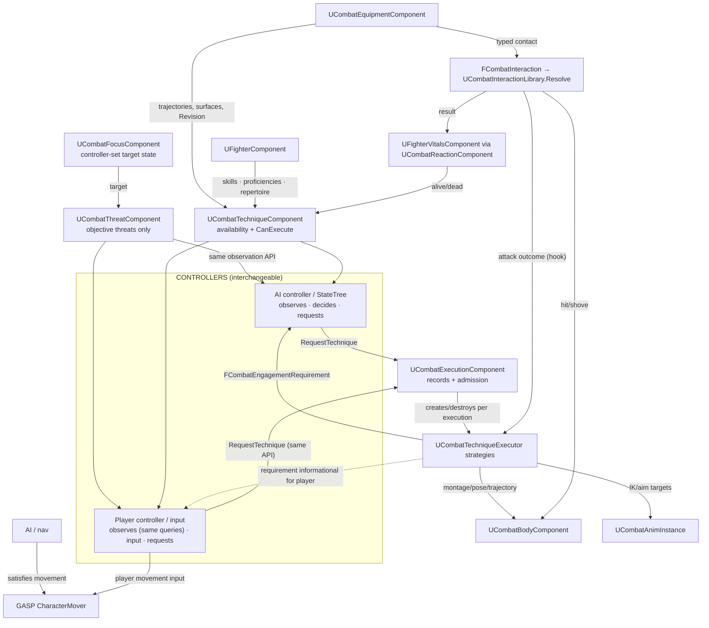

# Ironbound — Combat Runtime Architecture + Migration Plan (rev 3 — FINAL)

Planning only. Derived from the settled domain model, corrected through two review rounds, verified
against the current repository. Stale doc claims ignored (`COMBAT_ARCHITECTURE.md`'s
DT_AttackMasterMoves field list is wrong — `S_AttackMasterMove` has only DisplayName/Montage/SourceSequence).

---

## FINAL CONTROL-BOUNDARY VERDICT

**Rule applied to every class:**
- CONTROLLER (AI or Player): observes → decides → requests.
- PAWN COMBAT DOMAIN: exposes objective combat state, validates requests, executes Techniques, produces physical/gameplay results.
- MOVEMENT SYSTEM (GASP/CharacterMover + navigation): moves the character.
- PRESENTATION: visual/audio feedback.

| Question | Answer |
|---|---|
| Where does threat observation live? | **`UCombatThreatComponent`** (per-fighter ActorComponent, pawn domain). Measures/exposes objective incoming-attack state: attacker, weapon, technique id, committed trajectory sample, predicted contact, time-to-impact, direction. Computes from the attacker's committed execution (existing `UpdateAttackTimingState()`/timing math moves here). It never decides and never requests. |
| Where does the AI decision live? | The **AI controller** (`BP_FIghterAIController` temporarily, StateTree later). Reads observations + availability, chooses Technique, calls the same `RequestTechnique`. No combat policy inside pawns. |
| Where does the player decision live? | **Player input** (Enhanced Input on the pawn/player controller) choosing a Technique; context (e.g. threat) obtained from the same `UCombatThreatComponent` queries. UI indicators are presentation, optional. |
| Where does Technique validation live? | Pawn domain: stable availability (`UCombatTechniqueComponent`, event-driven) + transient `CanExecute(technique, context)` at request time + admission policy in `UCombatExecutionComponent`. |
| Where does Technique execution live? | Pawn domain: `UCombatExecutionComponent` creates per-execution `UCombatTechniqueExecutor` records (Solve/Intercept/Contact/Recover etc.). Executors never decide that a Technique should happen and never wait indefinitely. |
| How does movement ownership work? | Executors **emit** `FCombatEngagementRequirement` (range/position/facing/`bMayMoveDuringExecution`); they never navigate. AI controller satisfies it via nav+Mover; a player-controlled fighter moves freely and the Technique simply waits until conditions are met. Authored warping/alignment assistance (e.g. synchronized-pair alignment) is executor-internal authored content, distinct from locomotion/navigation. |

**Control flows (same pawn API, both origins):**

AI vs AI: AI(A) picks `Sword_Overhead_01` → `RequestTechnique` → arbiter admission → `UCombatExecutor_MeleeStrike` executes → trajectory observable → AI(B) reads `UCombatThreatComponent` → AI(B) picks `Sword_Parry` → `CanExecute(Sword_Parry, ThreatContext)` → `RequestTechnique` → `UCombatExecutor_ProceduralParry` (Solve→Intercept→Contact→Recover→destroyed).

Player vs AI / AI vs Player: player input requests `Sword_Overhead_01` (or presses Parry; threat context from `GetPrimaryIncomingThreat()`) → **identical** `RequestTechnique` → identical validation → identical executors. `UCombatExecutionComponent` cannot distinguish request origin and must not care.

**Prototype facts are not constraints:** the current one-possessed-pawn arrangement, `BP_FIghterAIController`'s timer, and Pawn1's disabled possession are temporary. `L_CombatPrototype` will be rebuilt as part of the refactor (AI-vs-AI via production APIs, then Player-vs-AI acceptance). No pawn component contains AI policy: the rev-2 `UCombatReactiveComponent` (auto-requesting) is **removed** and replaced by the observation-only `UCombatThreatComponent`.

---

## Corrections carried forward (rev 2, unchanged)

1. Execution records, not singular `ActiveExecutor`: arbiter owns `TArray<FCombatExecutionRecord>`; admission **policy** = max 1 Deliberate + max 1 Reactive, reactive may coexist with deliberate (matches today's un-arbitrated brace). No scheduler added.
2. No permanent waiting executors: executors are created per execution, destroyed at terminal.
3. `BattleRepertoire` contains **Technique ids**; selection validated against the technique's skill requirements.
4. Skill identity decoupled now: FName skills (`OverheadStrike`, `Thrust`, `Parry`), `RequiredSkills` on rows, no Skill DataTable, authored fighter defaults migrated away from `Attack_001` (no saves exist).
5. `FCombatDamageProfile.CompatibilityDamage` is transitional migration behavior only; `FCombatInteraction` preserves the physical inputs for the future physical damage model (deferred).
6. No interaction world subsystem: typed `FCombatInteraction`/`FCombatInteractionResult` + stateless `UCombatInteractionLibrary::Resolve` seam; direct attacker→victim routing for sword/body; direct cross-actor notify for weapon/weapon; subsystem only if fan-out later justifies it (additive).
7. Movement seam (requirement contract + nav leaving combat code) lands **before** executor extraction.
8. Class **and** filename renames are a hard requirement (Pass 8), with CoreRedirects, full rebuild, asset re-saves, no permanent wrappers.

### Concepts deliberately collapsed (not created)
Technique definition = row + config DataAsset; loadout = `BattleRepertoire` array; request = struct; runtime execution = record struct + executor UObject; movement = requirement struct + controller consumption; reactive policy = none on pawn (decisions belong to controllers); skill table = none; body arbitration = none (scope vocabulary only); interaction subsystem = none (typed structs + stateless resolver).

---

## A. Runtime architecture

### A.1 Class inventory

| # | Name | Kind | Single responsibility | Owner/lifetime | Key inputs | Key outputs | Migrates from | Must NOT own |
|---|---|---|---|---|---|---|---|---|
| 1 | `FCombatTechniqueRow` | USTRUCT (FTableRowBase) in `DT_CombatTechniques` | Identity (RowName=TechniqueId), tags incl. trigger tag, `RequiredSkills: TArray<FName>`, weapon family/surface/grip reqs, `BodyScope`, context reqs, execution-config ref, `FCombatDamageProfile` | Asset | — | — | `S_AttackMasterMove` identity | Execution internals; final damage model |
| 2 | `UCombatTechniqueExecutionConfig` + `UExecConfig_MeleeStrike`, `UExecConfig_ProceduralParry` (+ later BowShot, SynchronizedPair) | UDataAsset per executor | Authored executor binding (`ExecutorClass`) + config | Assets | — | — | row Montage/SourceSequence; parry solver UPROPERTYs; melee tolerances | Runtime state |
| 3 | `UWeaponDefinition` | UDataAsset (file split to `WeaponDefinition.h`) | Physical weapon: mesh, mass, family tag, grips, strike/parry surfaces | Asset | — | — | existing + Family/Grips/Surfaces | Fighter knowledge; granting techniques |
| 4 | `FFighterWeaponProficiency` | USTRUCT | Permanent per-family proficiency | Inside `FFighter` | — | — | new | Battle modification (later) |
| 5 | `UFighterComponent` (evolves) | ActorComponent | Identity; permanent knowledge = **skills + weapon proficiencies**; battle attrs; `BattleRepertoire: TArray<FName>` (Technique ids); team | Fighter actor | `FFighter` | `SelectBattleTechnique(FName TechniqueId)` (validates RequiredSkills learned), lookups, `BattleTeamId` | itself; replaces `BattleSkills` + Skillset loadout | Availability; equipment; policy |
| 6 | `UCombatTechniqueComponent` (new) | ActorComponent | Stable availability cache + transient `CanExecute(technique, context)` + row queries + proficiency read-through | Fighter actor; cache on battle init / repertoire / equipment `Revision` / grip | FighterComponent, EquipmentComponent, DT_CombatTechniques, Vitals | available set, `IsAvailable`, `CanExecute`, row snapshots | `UIronboundPawnSkillsetComponent` | Execution; threat measurement; per-frame recompute |
| 7 | `UCombatThreatComponent` (new, thin) | ActorComponent | **Objective combat observation only**: measures and exposes incoming-attack threats (from focus target's committed execution); no decisions, no requests, no policy | Fighter actor, persistent, ticks without needing possession (also consumed by player path) | focus target's arbiter state (committed trajectory/transform), own body/weapon geometry | `GetIncomingThreats()`, `GetPrimaryIncomingThreat()`, `BuildThreatContext()` → `FCombatThreat{ Attacker, Weapon, TechniqueId, ContactPoint, Direction, TimeToImpact, SourceTrajectory }` | parry component observation half: `UpdateAttackTimingState()`, `GetIncomingSourcePlaybackTime()`, `GetTimeUntilIncomingSample()`, recognition bookkeeping | Choosing responses; requesting techniques; parry policy; solver |
| 8 | `UCombatEquipmentComponent` (rename) | ActorComponent | Equip lifecycle, weapon instance, Revision, trajectory cache, contact classification, typed contact events | Fighter actor | `UWeaponDefinition` | family/grip/surface queries, trajectories, contact classification | existing | Technique logic; damage application |
| 9 | `UCombatFocusComponent` (rename) | ActorComponent | **Holds the controller-selected target** (state + validation); selection itself belongs to the controller; `bAutoAcquireTarget` auto-pick retires to controller-side policy | Fighter actor | controller set-target calls | CombatTarget | existing | Tactical decisions; team duplication (read-through `BattleTeamId`) |
| 10 | `UCombatExecutionComponent` (rename + refactor) | ActorComponent | Request admission (policy) + collection of active execution records + per-record lifecycle to terminal + aggregate queries; future cross-actor reserve/accept | Fighter actor | `FCombatTechniqueRequest` (origin-agnostic: AI or player), executor callbacks, movement-satisfaction queries | per-record state; aggregates (`IsCommitted`, `IsStrikeWindowOpen`, committed strike trajectory); engagement-requirement relay | `UIronboundCombatExecutionComponent` skeleton | Melee specifics; navigation; AI policy; request-origin awareness |
| 11 | `FCombatExecutionRecord` | USTRUCT | One active execution: TechniqueId, Kind (Deliberate/Reactive), `BodyScope`, State, executor ptr, execution-scoped contact dedup flag | Member of arbiter record array; destroyed at terminal | — | — | singular Phase/ActiveExecutor members | — |
| 12 | `UCombatTechniqueExecutor` (abstract UObject) + `UCombatExecutor_MeleeStrike`, `UCombatExecutor_ProceduralParry` (later BowShot, SynchronizedPair) | UObject strategies | **One active execution**: internal phases, planned data, completion report | Created per execution by arbiter; destroyed at terminal | row snapshot, config, participants, threat context (reactive), fighter components | phases, `FCombatEngagementRequirement`, montage/pose control, trajectory, terminal result | exec component melee logic; parry solver half | Deciding to execute; waiting indefinitely; navigation; final damage model |
| 13 | `FCombatInteraction` / `FCombatInteractionResult` | USTRUCTs | Typed interaction contract (type tags, participants, technique ids, contact point/normal/impulse, tip speed, weapon mass, body region) | Transient | — | → Reaction/Vitals/Body/executors | bare `float DamageAmount` | — |
| 14 | `UCombatInteractionLibrary` | Stateless static library | Resolves interaction → result (today CompatibilityDamage; tomorrow physical model) | None | interaction, weapon data | result | pawn BP damage arithmetic | State; routing; dedup |
| 15 | `FCombatTechniqueRequest` | USTRUCT | TechniqueId, target, participants, `FCombatThreatContext` payload | Transient | — | — | `PrepareAttack(TargetMesh, Sequence)` params | Request-origin awareness |
| 16 | `FCombatThreat` / `FCombatThreatContext` | USTRUCTs | Objective threat observation + payload attached to requests | Transient | — | — | parry candidate timing inputs | Decision logic |
| 17 | `FCombatEngagementRequirement` | USTRUCT | Movement/facing requirement output | Executor output → controller contract | — | consumed by AI controller (MoveTo/Mover) or ignored by player movement | orientation/arrival inputs | Nav execution |
| 18 | `FCombatBodyScope` | USTRUCT | Region tags + `bAllowsLocomotion` | In row data | — | Body/AnimGraph consumers | parry arm assumption; hardcoded bone lists | Arbitration (deferred) |
| 19 | `UCombatBodyComponent`, `UCombatAnimInstance`, `UCombatTrajectoryLibrary`, `UCombatAttackWindow`, `UCombatReactionComponent`, `UFighterVitalsComponent`, `ABattleManager` | rename/keep | unchanged | — | — | — | — | — |

**Controller/pawn API boundary (single, origin-agnostic):**
`UCombatExecutionComponent::RequestTechnique(const FCombatTechniqueRequest&)` — the ONLY submission point. AI controllers, player input, and future StateTree all call it. Pawn-side validation: availability → `CanExecute(technique, context)` → admission policy. No AI-specific or player-specific combat APIs exist. Observation API (`UCombatThreatComponent` queries, availability, `CanExecute`) is controller-agnostic and consumed identically by both.

### A.2 Responsibility diagram



---

## B. Authored data model

- **`DT_CombatTechniques`** (`FCombatTechniqueRow`): TechniqueId row name (`Sword_Overhead_01`, `Sword_Thrust_01`, `Sword_Parry`, `Bow_Shot`, `Jumping_Takedown`); `DisplayName`; `Tags` incl. trigger (`Technique.Trigger.ReactiveIncomingMelee`); `RequiredSkills: TArray<FName>` (Skill ids: `Sword_Overhead_01→OverheadStrike`, `Sword_Thrust_01→Thrust`, `Sword_Parry→Parry`); weapon requirements (families/surface roles/grip); `MinProficiencies` reserved; `BodyScope`; context reqs; `ExecutionConfig: TObjectPtr<UCombatTechniqueExecutionConfig>` (hard ref); `FCombatDamageProfile { CompatibilityDamage, ImpulseScale }` — transitional.
- **Execution-config DataAssets**: `DA_Exec_SwordOverhead01` {Montage `AM_Mocap_SwordSwing_01`, SourceSequence `AS_Mocap_SwordBatch02_Attack01_UEFN`, melee tolerances, CombatTargets ref}; `DA_Exec_SwordParry` {solver policy moved verbatim}; later BowShot/SynchronizedPair.
- **Skills**: FName ids (`OverheadStrike`, `Thrust`, `Parry`, …), no DataTable, no tags (open content-defined vocabulary; tags would force `DefaultGameplayTags.ini` registration for an open set and add no query benefit; category questions belong to Technique tags). `FFighter.LearnedSkills { SkillId, Proficiency }` unchanged in shape; identity migrated from `Attack_001`.
- **`UWeaponDefinition`** (`DA_Sword1a`): + FamilyTag, `Grips[]`, `Surfaces[]` (initial content = existing grip; parry band mirrors solver 0.30–0.78).
- **`DT_CombatTargets`** kept; row struct renamed `FCombatTargetRow` (reference moves into melee config).
- **Tags**: `Weapon.Family.*`, `Technique.Category.*`, `Technique.Trigger.*`, `Body.*`.

## C. Runtime state

| State | Where | Update trigger |
|---|---|---|
| Battle attributes / team | `UFighterComponent` | unchanged |
| Battle repertoire (**Technique ids**) | `UFighterComponent.BattleRepertoire` | player/AI-assisted pre-battle selection, RequiredSkills-validated |
| Available Techniques (stable) | `UCombatTechniqueComponent` cache | battle init, repertoire, equipment `Revision`/grip |
| Transient validity | `CanExecute(technique, context)` | consideration/request time |
| Combat observations (threats) | `UCombatThreatComponent` — derived, cached per tick, **transient** | focus-target arbiter state |
| Active executions | arbiter record array + admission policy | request/executor callbacks; destroyed at terminal |
| Focus target | `UCombatFocusComponent` (controller-written state) | controller decision |
| Vitals/equipment | as today | unchanged |

---

## D. Existing → new mapping

| Existing | Fate | Goes to |
|---|---|---|
| `FFighter`/`FLearnedSkill`/`FFighterAttributes` | keep/extend; skill ids migrated (`Attack_001`→`OverheadStrike` etc.) | `FFighter` + `FFighterWeaponProficiency` |
| `FighterComponent.BattleSkills` (no BP consumers found) | replace | `BattleRepertoire: TArray<FName>` (Technique ids) |
| `UIronboundPawnSkillsetComponent` (AttackMoves; `bCanParry` verified dead — only declaration at IronboundPawnSkillsetComponent.h:28, no C++/BP consumers) | retire | `UCombatTechniqueComponent` + repertoire |
| `S_AttackMasterMove`/`DT_AttackMasterMoves` | retire (parallel-build + switch) | `DT_CombatTechniques` + `DA_Exec_*` |
| `UIronboundCombatExecutionComponent` | split | arbiter skeleton → `UCombatExecutionComponent` (records/admission, origin-agnostic request API); melee logic → `UCombatExecutor_MeleeStrike`; `MoveToLocation` (cpp:351) → controller layer via `FCombatEngagementRequirement` (Pass 5, before extraction); tolerances → config |
| `UIronboundParryComponent` | **split by responsibility** — see E.2 | observation/perception → `UCombatThreatComponent`; solving/execution → `UCombatExecutor_ProceduralParry`; policy → `DA_Exec_SwordParry`; `ParrySkill` → fighter proficiency (0.5 parity fallback) |
| `bCanParry` | retire (dead code) | availability/repertoire |
| `UIronboundEquipmentComponent` / `UIronboundWeaponDefinition` | rename+extend (+ file split) | `UCombatEquipmentComponent` / `UWeaponDefinition` |
| `UIronboundTrajectoryLibrary`, `UIronboundAttackWindow`, `UIronboundCombatFocusComponent`, `UIronboundCombatBodyComponent`, `UIronboundCombatAnimInstance`, `FIronboundCombatTargetRow` | rename (class + files) | `UCombatTrajectoryLibrary`, `UCombatAttackWindow`, `UCombatFocusComponent`, `UCombatBodyComponent`, `UCombatAnimInstance`, `FCombatTargetRow` |
| Pawn BP `DamagePerHit`, `HasDealtDamageThisAttack` | retire | `CompatibilityDamage` via `UCombatInteractionLibrary`; execution-scoped dedup |
| Pawn BP `ChooseAttack/PrepareSelectedAttack/ResolveAttackTarget/ComitSelectedAttack` | retire | availability → `RequestTechnique` (controller-agnostic); montage playback into melee executor |
| `BP_FIghterAIController` timer + attack selection | reworked | controller-layer decision over observation/availability APIs; defense decisions added; rebuilt for production test scene |
| Pawn `Attack` event / input path | redirected | player input path calling the same `RequestTechnique` |
| `Focus.bAutoAcquireTarget` auto-pick tick | retire (prototype AI policy in pawn) | controller-side target selection; focus keeps state/validation |
| Duplicated team state; legacy pawn variants | retire | `BattleTeamId` single source; scene rebuild |

## E. Reference-case traces

**E.1 — Sword_Overhead_01 (controller involvement explicit)**
1. **Decide**: AI controller reads observations (threat component of its target = empty, availability) and picks `Sword_Overhead_01` — **or** player input picks it. Either path: `CanExecute(Sword_Overhead_01, {target, range})` → `RequestTechnique`.
2. Arbiter admission (Deliberate slot free) → record + `UCombatExecutor_MeleeStrike` (row + `DA_Exec_SwordOverhead01`).
3. *Prepare*: trajectory from SourceSequence + authored grip (Revision-gated cache); alignment solve vs `FCombatTargetRow` regions.
4. Executor emits `FCombatEngagementRequirement`; **AI fighter**: controller satisfies via MoveTo/Mover. **Player fighter**: player moves freely; executor waits for alignment (load proceeds while approaching either way).
5. *Commit*: alignment + settled speed + actual-pose contact → montage in C++ → `UCombatAttackWindow` notify opens/closes the record's window → `UCombatBodyComponent` upper-body Physics Control (legs animated).
6. Blade/body contact → `FCombatInteraction` → `UCombatInteractionLibrary.Resolve` (CompatibilityDamage 10) → `UCombatReactionComponent::ReceiveInteraction` → vitals; one-hit dedup execution-scoped.
7. Montage end → *Recover* → terminal → record destroyed.

**E.2 — Sword_Parry (rewritten per control boundary)**

```
ATTACKER (AI or player) → committed sword execution
  trajectory becomes observable combat state (arbiter record)

DEFENDER OBSERVATION (pawn domain, no decisions)
  UCombatThreatComponent: reads attacker's committed trajectory/transform + playback time,
  predicts contact point / time-to-impact / direction → FCombatThreat
  (migrates: UpdateAttackTimingState + GetIncomingSourcePlaybackTime + GetTimeUntilIncomingSample
   + recognition bookkeeping from UIronboundParryComponent)

CONTROLLER (decision)
  AI: observes threat → is Sword_Parry available? CanExecute(Sword_Parry, ThreatContext)? → request
  Player: perceives threat (visually / optional UI) → presses Parry →
          BuildThreatContext(GetPrimaryIncomingThreat()) → request

DEFENDER (pawn domain, validation)
  UCombatTechniqueComponent.CanExecute(Sword_Parry, ThreatContext)
  → UCombatExecutionComponent.RequestTechnique({Sword_Parry, ThreatContext})

COMBAT EXECUTION (pawn domain)
  admission (Reactive slot) → FCombatExecutionRecord → UCombatExecutor_ProceduralParry created

PARRY EXECUTOR (execution only — never decides to parry)
  Solve      — candidates from DA_Exec_SwordParry policy; weapon family/surface/grip constrain
               solutions; proficiency read-through scales policy (migrates: FindBestParryCandidate,
               EvaluateCandidate, comfort/policy math)
  Intercept  — UCombatAnimInstance targets → CR_IronboundParry CCDIK; live trajectory re-reads
  Contact    — UCombatBodyComponent brace + grip spring; weapon/weapon FCombatInteraction
  Recover    — brace ends; terminal; executor destroyed
```
`bCanParry`, `ParrySkill`, and any pawn-side auto-request are gone. Perception/reaction delay semantics: perception delay stays with threat measurement; **reaction delay becomes a controller trait** (AI decision latency; player has input latency instead).

**E.3 — Bow_Shot (post-migration feature; architecture admits it)**
Availability (repertoire + Bow family + proficiency) → AI choice or player input → `UCombatExecutor_BowShot`: Draw/Aim (anim + procedural aim, `BodyScope [Arm.L, Arm.R, Torso]`, locomotion continues; facing requirement informational for player) → Release spawns gameplay projectile → `FCombatInteraction(Projectile/Body)` → vitals.

**E.4 — Jumping_Takedown (architecture admits it)**
`CanExecute` with both actors → `RequestTechnique` (Deliberate, participants) → arbiter *Reserve* (receiver gains Reserved Deliberate record, locks own requests) → *Align* (engagement requirements for both; receiver movement via its own controller/Mover) → paired montages, full-body scope both → `FCombatInteraction(Fighter/Fighter)` → both terminal. Authored warping/alignment assistance inside the executor is executor-internal authored content, distinct from navigation.

**E.5 — Control tests (acceptance criteria, same pawn APIs throughout)**
- **A — AI vs AI**: A's AI picks `Sword_Overhead_01`; B's AI observes threat (via `UCombatThreatComponent`) and picks `Sword_Parry`; identical executors as any other origin.
- **B — Player vs AI**: player input requests `Sword_Overhead_01` on Fighter A; B (AI) parries as in A. Fighter A's components unchanged from AI case.
- **C — AI vs Player**: A (AI) attacks; player on B presses Parry; request carries/obtains threat context from `UCombatThreatComponent`; same `UCombatExecutor_ProceduralParry`.
- **D — Player vs Player**: both fighters receive player-originated requests through the same `RequestTechnique`; `UCombatExecutionComponent` remains origin-agnostic.

---

## F. Migration passes (each compiles + tests)

Standing verification: build `IronboundEditor Win64 Development` (full build for the rename pass; report Live Coding locks separately). Per-pass regression = duel scenario (approach from 2,000 cm, ten 10-damage hits, death, idle); from Pass 7 add the parry scenario; after Pass 8 add control tests A–C as acceptance tests. `L_CombatPrototype` is expected to be reconfigured (AI controllers on both fighters; later a player-controlled fighter) — prototype possession arrangements are not preserved architecturally. Commit before each pass; BP backups in the existing ignored baseline folder.

**Pass 1 — Foundation types + data (additive, zero behavior change)**
- Add: `FCombatTechniqueRow`, `FCombatDamageProfile`, `FCombatBodyScope`, `FCombatThreat(Context)`, `FCombatTechniqueRequest`, `ECombatExecutionState/Kind`, `FCombatInteraction/Result`, `UCombatInteractionLibrary`, `UCombatTechniqueExecutionConfig` + `UExecConfig_MeleeStrike`; tags (`Weapon.Family.*`, `Technique.Category.*`, `Technique.Trigger.*`, `Body.*`).
- Data: `DT_CombatTechniques` row `Sword_Overhead_01` → `DA_Exec_SwordOverhead01` (Montage/SourceSequence copied; CompatibilityDamage 10); `UWeaponDefinition` extended (family/surfaces/grips; `DA_Sword1a` updated).
- BP: none. Verify: compile; duel unchanged. Rollback: revert (additive).

**Pass 2 — Fighter knowledge + skill identity migration**
- `FFighter` + `WeaponProficiencies`; skill vocabulary (`OverheadStrike`, `Thrust`, `Parry`) in pawn `SelfFighter.LearnedSkills` (BP default edit); `FLearnedSkill` comment de-coupled from attack rows; `BattleRepertoire` (Technique ids) + `SelectBattleTechnique(FName TechniqueId)` (RequiredSkills-validated); old `BattleSkills` kept deprecated (removed Pass 9).
- Verify: duel unchanged. Rollback: trivial.

**Pass 3 — Technique component + availability (additive)**
- Add `UCombatThreatComponent`: focus-target committed-trajectory observation migrated from the parry component (`UpdateAttackTimingState`-equivalent math), `FCombatThreat` derivation (contact prediction, time-to-impact), `GetIncomingThreats/GetPrimaryIncomingThreat/BuildThreatContext`. **No decisions, no requests** — pure objective state.
- Verify: PIE log shows threat appearing when attacker commits, disappearing at terminal. Rollback: remove files/component.

**Pass 4 — Typed interaction path + damage relocation**
- Pawn BP sword-body collision → build `FCombatInteraction` → `UCombatInteractionLibrary.Resolve` (CompatibilityDamage) → `UCombatReactionComponent::ReceiveInteraction` (typed overload; float path kept temporarily). `DamagePerHit` + `HasDealtDamageThisAttack` deleted; dedup execution-scoped on the attacker record.
- Verify: duel damage identical; resting-contact no-drain; observer rejects. Rollback: revert BP.

**Pass 5 — Movement-requirement seam (nav leaves combat)**
- `FCombatEngagementRequirement` output on `UIronboundCombatExecutionComponent`; delete `ApproachAttackPosition()`/`AIController::MoveToLocation` from the component; controller BP consumes the requirement (same MoveTo call; ownership change only). Player-controlled fighters: requirement is informational; executor waits.
- Verify: approach/align stats identical (arrival radius, ≤3° yaw, settled speed). Rollback: revert nav ownership.

**Pass 6 — Melee executor extraction; arbiter records; retire old attack path**
- Add `UCombatTechniqueExecutor` + `UCombatExecutor_MeleeStrike` (born without navigation code; trajectory build, alignment, commit/recover moved; montage playback in C++; tolerances + CombatTargets ref → `DA_Exec_SwordOverhead01`).
- Arbiter: record-based with admission policy (max 1 Deliberate + max 1 Reactive; coexistence matches today's un-arbitrated brace); `RequestTechnique` origin-agnostic; aggregate compatibility queries preserved.
- BP: pawn attack functions removed; controller picks availability → `RequestTechnique`. Retire `UIronboundPawnSkillsetComponent` (incl. dead `bCanParry`), `DT_AttackMasterMoves`, `S_AttackMasterMove`.
- Verify: full duel regression; weaponless/admission refusals clean. Rollback risk **high** — commit + backup first.

**Pass 7 — Parry executor + controller defense decisions (reactive policy leaves the pawn)**
- Add `UCombatExecutor_ProceduralParry` (solver half moved verbatim: `FindBestParryCandidate`, `EvaluateCandidate`, comfort math, executed-pose drive, brace; internal structs renamed `FParryCandidate`/`FParryPolicy` — verify no BP refs) + `DA_Exec_SwordParry` (policy; `ParrySkill` → proficiency, 0.5 fallback); author `Sword_Parry` row; repertoire includes it.
- Controller: `BP_FIghterAIController` gains defense decision (observe `UCombatThreatComponent` → choose `Sword_Parry` → `CanExecute` → `RequestTechnique` with threat context). Player parry input path added as minimal test scaffolding (Test C).
- BP: remove `CombatParry` component from pawn; retire `UIronboundParryComponent`, `ParrySkill`.
- Verify: Tests A and C (AI-vs-AI parry; player-parry against AI attack); executor created/destroyed per attack; diagnostics comparable to pre-migration solver run. Rollback: medium.

**Pass 8 — Renames (classes AND filenames) + CoreRedirects — hard requirement**
- Procedure: add `[CoreRedirects]` to `DefaultEngine.ini` first → `git mv` files + rename classes → update includes → **full rebuild** (never Live Coding) → load/compile all BPs, check LoadErrors → re-save `DT_CombatTargets`, pawn BP, ABP → old files gone by the move; no wrapper classes remain.
- Renames: `IronboundCombatExecutionComponent.* → CombatExecutionComponent.*` (`UCombatExecutionComponent`), `IronboundEquipmentComponent.* → CombatEquipmentComponent.*` (+ `UWeaponDefinition` → `WeaponDefinition.h`), `IronboundTrajectoryLibrary.* → CombatTrajectoryLibrary.*`, `IronboundCombatFocusComponent.* → CombatFocusComponent.*`, `IronboundCombatBodyComponent.* → CombatBodyComponent.*`, `IronboundCombatAnimInstance.* → CombatAnimInstance.*`, `IronboundAttackWindow.* → CombatAttackWindow.*`, `IronboundCombatTarget.h → CombatTarget.h` (`FCombatTargetRow`); `EIronboundAttackPhase → ECombatStrikePhase`. Already-clean files untouched (`FighterTypes.h`, `FighterComponent.*`, `BattleManager.*`, `FighterVitalsComponent.*`, `CombatReactionComponent.*`). Retired classes are not redirected.
- Verify: zero LoadErrors; duel + parry + control tests. Rollback: revert rename commit.

**Pass 9 — Scene reconfiguration + dedup/cleanup**
- Reconfigure `L_CombatPrototype` for production architecture: both fighters AI-controlled via the production APIs (Test A), then Fighter A player-possessed for Tests B/C (acceptance). Retire team duplication (`Focus.Team` read-through, BP `FighterTeam`/`InitFighterHealthAndTeam`), deprecated `BattleSkills`, legacy `SandboxCharacter_Mover_Auto5` (after level inventory), `_Ragdoll` variant audit; `Focus.bAutoAcquireTarget` auto-pick retired to controller-side policy.
- Verify: control tests A–D + duel + parry; grep removed symbols. Rollback: per-item.

**Post-migration feature work:** `UCombatExecutor_BowShot` + projectile; `UCombatExecutor_SynchronizedPair` + receiver reservation; physical damage resolution replacing the compatibility path; body-region drive ownership for concurrent partial-body Techniques; StateTree planner replacing the BP controller timer (the observation/availability/requirement contracts are its seams).

## G. Risks / Unreal-specific concerns

1. **Pawn BP rewrite (Passes 4/6) dominates regression risk** — one BP concern per pass, backups, duel verification each.
2. **Control-boundary risk (Pass 7)**: defense decisions must land in the controller layer, not quietly remain in pawn code; verification is behavioral (Tests A–C) plus code review that `UCombatThreatComponent` and executors contain no request calls.
3. **Pass 8 renames**: redirects before any BP load; class+file renames together; full rebuild mandatory (report Live Coding locks separately, never as compile failures); SCS/AnimInstance/notify references rely on redirects; re-save assets; verify no old-name wrappers remain.
4. **Signature changes** (`PrepareAttack`→`RequestTechnique`, typed hit overloads) need manual BP re-pointing in the same pass as retirement.
5. **Parry parity**: solver moves verbatim; fixed-scenario candidate equality asserted before removing the old component; perception bookkeeping moves with `UCombatThreatComponent`, reaction latency moves to the controller — verify timing equivalence in Tests A/C.
6. **Damage regression (Pass 4)**: preserve strike-window gating and one-hit dedup; resting-contact no-drain verified.
7. **GameplayTags** additions via `DefaultGameplayTags.ini`; no BP-created tags.
8. No permanent dual-living: every new system retires its old counterpart in the same or next pass.

## H. Remaining decisions (genuinely material; rest safely deferred)

1. **Skill id vocabulary sign-off** — final names (`OverheadStrike`, `Thrust`, `Parry`) before Pass 2 rewrites authored data. Recommend exactly these.
2. **Weapon/weapon outcome feedback** — whether a resolved parry can force the attacker's strike terminal (`Failed/Deflected`) or stays emergent physics. Recommend: emergent now; additive `OnInteractionResolved` executor hook; decide before Pass 7.
3. **Montage playback detail** — C++ `Montage_Play` in executor (recommended) vs keeping BP proxy one extra pass; affects Pass 6 BP surgery size.
4. **Player input scaffolding scope for Tests B/C** — minimal Enhanced Input bindings in the test scene (technique picker + parry input reading threat context); confirm acceptable as test-only scaffolding.

Deferred: body-resource arbitration; physical damage formula; StateTree planner; multi-actor reservation internals; committed-trajectory query qualifiers (multi-weapon seam); `MinProficiencies` enforcement; player threat UI/presentation.

## Sanity result

AI-vs-AI and Player-vs-AI / AI-vs-Player flows converge on one `RequestTechnique` boundary, one observation API (`UCombatThreatComponent`), one availability/validation boundary, and identical executors. No pawn component holds AI policy (rev-2 `UCombatReactiveComponent` removed). Movement is a requirement contract satisfied by whichever controller owns the fighter. Possession arrangement is irrelevant to the combat domain; the prototype scene will be rebuilt to prove it (Tests A–D). Cases 1–4 plus the dual-wield concurrency case trace without structural rewrites.